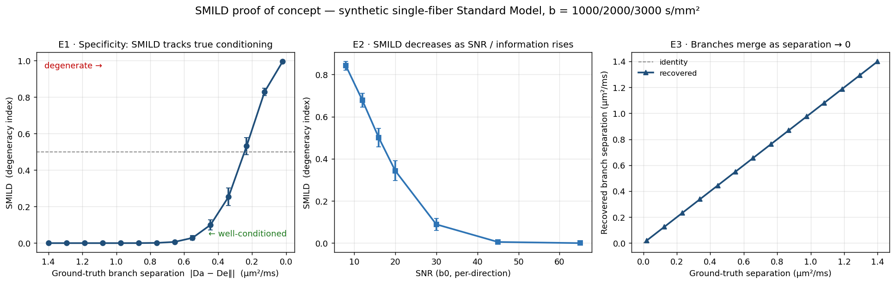

# SMILD
## Standard Model Inter-branch Likelihood Distance

**A voxelwise measure of practical parameter identifiability for biophysical diffusion MRI.**

[](LICENSE)
[](https://www.python.org/)
[](https://doi.org/10.5281/zenodo.21346103)
[]()

---

## What it is

The Standard Model of white-matter diffusion (Novikov et al. 2019) unifies NODDI, WMTI, SMT, and related microstructure models as special cases of one signal kernel. Fitting this model to conventional multi-shell linear-encoding data (b = 1000/2000/3000 s/mm²) is an **intrinsically degenerate inverse problem**: two distinct parameter sets — the two "branches" — explain the measured signal equally well. This is not noise; it is a structural property of the measurement (Jelescu et al. 2016; Novikov et al. 2018). Standard pipelines hide the degeneracy by fixing parameters (e.g. NODDI pins the intra-neurite axial diffusivity to 1.7 µm²/ms), yielding a unique but potentially biased answer.

**SMILD** makes the degeneracy explicit. It measures the **noise-normalized distance between the two branch solutions in signal space** — i.e., whether the data can actually tell the branches apart. The output is a per-voxel scalar on [0, 1]:

- **SMILD → 1**: the two branches predict nearly identical signals; the data cannot distinguish them; any reported microstructure estimate is effectively arbitrary between the two solutions.
- **SMILD → 0**: the branches predict signals far apart relative to noise; the data resolves the solution; the estimate is trustworthy.

SMILD is not another microstructure parameter. It is a **reliability map for the parameters you already compute** — an audit layer that makes every NODDI/SM output in a pipeline interpretable in terms of whether the data actually supported it.

---

## Motivation

The Standard Model degeneracy is the field's central unsolved estimation problem. Several routes to resolving it exist (double-diffusion encoding, b-tensor encoding, varied diffusion times) but none are available in large existing repositories (ABCD, HCP, UK Biobank), which use single-encoding multi-shell acquisitions. For those datasets — and for most clinical acquisitions — the degeneracy cannot be broken retrospectively.

The responsible response is to **measure and report it** rather than hide it. SMILD is that measurement.

---

## Status

This is **early development**. The repository currently contains:

- `poc/` — A proof-of-concept demonstrating the SMILD quantity on synthetic single-fiber Standard-Model data with known ground truth. All three falsifiable predictions verified (**all pass**).
- `docs/` — Full theoretical framework and methods specification (knowledge base, estimand definitions, validation protocol, verified reference list).
- `smild/` — Package skeleton. Core forward model and degenerate-twin construction are implemented. Production RotInv/LEMONADE two-branch solver is the next build target.

The POC is functional and can be run today. The production estimator for real multi-shell dMRI data is in active development.

---

## Proof of concept results

On synthetic single-fiber Standard-Model data (b = 500/1000/2000/3000 s/mm², ABCD-like SNR):

| Prediction | Result | Status |
|---|---|---|
| SMILD is low where branches are far apart (well-conditioned) and high where they coincide (degenerate) | Spearman r = −1.00 with ground-truth branch separation | ✅ PASS |
| As the true branch split → 0, SMILD → 1 and branches converge | SMILD = 0.995 at smallest split, 0.000 at largest | ✅ PASS |
| SMILD decreases as SNR / information content rises | Spearman r = −1.00 with SNR | ✅ PASS |



---

## Quick start

```bash
git clone https://github.com/TravisBeckwith/SMILD.git
cd SMILD
pip install -e ".[dev]"

# Run the proof of concept
python poc/smild_experiment.py
```

Requirements: Python ≥ 3.10, numpy, scipy, matplotlib. No MRI data needed for the POC.

---

## Theoretical grounding

SMILD measures the **practical local identifiability** of the Standard Model inverse problem. In estimation-theory terms, it is a finite-difference proxy for the conditioning of the parameter-to-signal map: voxels where the map is near-singular (the two branch solutions produce nearly identical signals) get high SMILD; voxels where the map is well-conditioned (branches produce distinguishable signals) get low SMILD.

Formally (Definition 1 from the methods document):

```
ΔR = || M(θ⁺) − M(θ⁻) ||_Σ         (Mahalanobis distance between branch signals)
SMILD = exp(−ΔR² / 2)  ∈ [0, 1]
```

where `θ⁺`, `θ⁻` are the two branch parameter vectors, `M(·)` is the Standard Model forward map into the rotational-invariant space, and `Σ` is the per-voxel noise covariance.

The two branches are constructed as the **exact moment-preserving degenerate twin**: the intra-/extra-axonal axial-diffusivity swap that preserves the cumulant-accessible moments M₁ (mean axial diffusivity) and V (across-compartment axial variance). This is the analytic structure underlying the degeneracy (Fieremans et al. 2011; Novikov et al. 2018, Eq. 5.3).

See `docs/SMILD_KnowledgeBase_Theory_Methods.docx` for the full derivation, all equations, and the validation protocol.

---

## Integration with dwiforge

SMILD is designed as a post-microstructure stage in the [dwiforge](https://github.com/TravisBeckwith/dwiforge) diffusion MRI pipeline, consuming preprocessed DWIs from Stage 05 and optionally the NODDI outputs from Stage 07:

```
Stage 12a  rotational invariants + noise covariance
Stage 12b  Standard Model two-branch fit
Stage 12c  SMILD map (per-voxel, per-parameter)
Stage 12d  ROI extraction + QC panel
```

The [dwiforge Stage 11 connectome-stats](https://github.com/TravisBeckwith/dwiforge) CLR transform (compositional correction of connectome edge weights) is a companion output — together they provide both a microstructural reliability map and a statistically valid group-analysis-ready connectome.

---

## Planned validation (ABCD Study)

The intended validation cohort is the [Adolescent Brain Cognitive Development (ABCD) Study](https://abcdstudy.org/) (Casey et al. 2018; Hagler et al. 2019), which provides multi-shell dMRI (b = 500/1000/2000/3000 s/mm²) across 21 sites and ~11,000 subjects ages 9–14. Five pre-registered validation experiments:

| Experiment | Prediction |
|---|---|
| **V1 — Anatomical specificity** | SMILD lowest in coherent single-fiber WM (corpus callosum body, CST core), highest in crossing regions and cortical GM |
| **V2 — Test–retest reliability** | ICC ≥ 0.75 per ROI in WM, comparable to established SM parameters |
| **V3 — SNR / information dependence** | SMILD increases monotonically as directions / shells are subsampled |
| **V4 — Developmental trajectory** | Spatially structured age effects in late-myelinating tracts (SLF, frontal forceps, cingulum) |
| **V5 — Utility as reliability weight** | SMILD-weighting improves brain–behavior effect reproducibility across sites |

---

## Roadmap

- [x] Forward model and degenerate-twin construction (`smild/forward.py`)
- [x] SMILD computation from known ground truth (`smild/smild.py`)
- [x] Proof-of-concept validation on synthetic data (`poc/`)
- [x] Full theoretical framework and methods document (`docs/`)
- [ ] Rotational-invariant estimation from real multi-shell DWI
- [ ] LEMONADE / analytic two-branch solver for arbitrary ODFs
- [ ] Posterior-dispersion SMILD (Definition 2, from ML posterior)
- [ ] dwiforge Stage 12a–12d shell scripts
- [ ] ABCD validation experiments V1–V5
- [ ] Comparison against NODDI, SMT, WMTI parameter maps

---

## Repository structure

```
smild/
├── smild/                  # Python package
│   ├── __init__.py
│   ├── forward.py          # Standard Model forward model (powder-averaged)
│   ├── smild.py            # Core SMILD computation
│   ├── twin.py             # Degenerate-twin construction
│   └── utils.py            # Noise, cumulants, helpers
├── poc/                    # Proof of concept
│   ├── smild_poc.py        # Core POC (forward + twin + SMILD)
│   ├── smild_experiment.py # Validation experiments E1/E2/E3
│   ├── smild_validation.png
│   ├── smild_results.csv
│   └── NOTES_equations.md  # Verified two-branch equations + sources
├── docs/
│   └── SMILD_KnowledgeBase_Theory_Methods.docx
├── tests/
│   └── test_smild_poc.py   # Unit tests (forward model, twin, SMILD bounds)
├── examples/               # Placeholder for real-data notebooks
├── pyproject.toml
├── LICENSE
└── README.md
```

---

## Citation

If you use SMILD in your research, please cite the software and the foundational papers on the Standard Model degeneracy.

### Citing the software

**APA**
```
Beckwith, T. (2026). SMILD: Standard Model Inter-branch Likelihood Distance
(Version 0.1.0) [Computer software]. Zenodo.
https://doi.org/10.5281/zenodo.21346103
```

**BibTeX**
```bibtex
@software{Beckwith_SMILD_2026,
  author    = {Beckwith, Travis},
  title     = {{SMILD: Standard Model Inter-branch Likelihood Distance}},
  version   = {0.1.0},
  year      = {2026},
  publisher = {Zenodo},
  doi       = {10.5281/zenodo.21346103},
  url       = {https://github.com/TravisBeckwith/SMILD}
}
```


---

### Foundational references

SMILD is grounded in and should be read alongside the following papers, which established the Standard Model degeneracy and its implications:

**The degeneracy** (the problem SMILD measures):
- Jelescu IO, Veraart J, Fieremans E, Novikov DS. Degeneracy in model parameter estimation for multi-compartmental diffusion in neuronal tissue. *NMR in Biomedicine.* 2016;29(1):33–47. doi:[10.1002/nbm.3450](https://doi.org/10.1002/nbm.3450)

**The rotational-invariant framework** (the signal space in which SMILD is computed):
- Novikov DS, Veraart J, Jelescu IO, Fieremans E. Rotationally-invariant mapping of scalar and orientational metrics of neuronal microstructure with diffusion MRI. *NeuroImage.* 2018;174:518–538. doi:[10.1016/j.neuroimage.2018.03.006](https://doi.org/10.1016/j.neuroimage.2018.03.006)

**The Standard Model review** (theoretical context):
- Novikov DS, Fieremans E, Jespersen SN, Kiselev VG. Quantifying brain microstructure with diffusion MRI: theory and parameter estimation. *NMR in Biomedicine.* 2019;32(4):e3998. doi:[10.1002/nbm.3998](https://doi.org/10.1002/nbm.3998)

**Resolving the degeneracy** (why it requires additional acquisition):
- Coelho S, Pozo JM, Jespersen SN, Jones DK, Frangi AF. Resolving degeneracy in diffusion MRI biophysical model parameter estimation using double diffusion encoding. *Magnetic Resonance in Medicine.* 2019;82(1):395–410. doi:[10.1002/mrm.27714](https://doi.org/10.1002/mrm.27714)

**Validation cohort**:
- Casey BJ, Cannonier T, Conley MI, et al. The Adolescent Brain Cognitive Development (ABCD) study: imaging acquisition across 21 sites. *Developmental Cognitive Neuroscience.* 2018;32:43–54. doi:[10.1016/j.dcn.2018.03.001](https://doi.org/10.1016/j.dcn.2018.03.001)
- Hagler DJ Jr, Hatton S, Cornejo MD, et al. Image processing and analysis methods for the Adolescent Brain Cognitive Development Study. *NeuroImage.* 2019;202:116091. doi:[10.1016/j.neuroimage.2019.116091](https://doi.org/10.1016/j.neuroimage.2019.116091)

---

## Zenodo

The v0.1.0 Zenodo record is live: [doi.org/10.5281/zenodo.21346103](https://doi.org/10.5281/zenodo.21346103).

**For future releases**
1. Update `version` in `pyproject.toml`, `smild/__init__.py`, `CITATION.cff`, and `.zenodo.json`.
2. Create a new GitHub release with a new version tag (e.g. `v0.2.0`). Zenodo archives it automatically.
3. Zenodo mints a new version-specific DOI for each release. The concept DOI (`10.5281/zenodo.21346103`, pointing to "all versions") stays the same — use it in the README badge and general citations. Use version-specific DOIs in methods papers that pin a specific release.
4. Add the new version DOI to the `identifiers` list in `CITATION.cff`.

---

## License

MIT. See [LICENSE](LICENSE).
